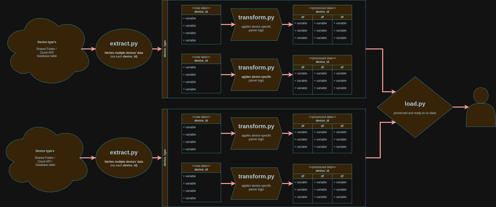

# MultiDevice Datakit

> 🚧 Work in progress !
> This is an evolving research data pipeline, not a finished product. 
> Structure and scope are actively changing as new devices and features come online.

A Python-based, portable, and customizable pipeline for pulling, standardizing, and storing multi-device research data — combining an
**API scheduler**, an **ETL pipeline**, and a **database deployer** into one lightweight data warehouse.

Built for a multi-site study tracking environmental exposure (Atmotube air quality sensors) and biometric data (Fitbit / Google Health) across rotating device assignments and multiple participants — but designed to be extended to any new device type with its own API and parser.

1. **What does this project do?**

- *Ingests*: Pulls each device's cloud API (Atmotube, Google Health/Fitbit) via threaded per-device requests, rate-limit aware. Scheduling is config-driven (`config/schedule.yml`) — the APScheduler wiring itself (`src/scheduler/`) isn't built yet, see Structure below.
- *Processes*: Standardizes and validates per device type — parsing raw API responses into row-dicts (not DataFrames — see note below) matching each destination table's columns exactly, ready for insert.
- *Stores*: Maintains a PostgreSQL + PostGIS database (via Docker) for raw + processed data, with upserts (`ON CONFLICT ... DO UPDATE`) so re-pulling overlapping date ranges is safe, and device/participant assignment tracking (`config/participants.yml`) to reconcile data across a rotating-device study design.
- *Visualizes*: Provides non-technical abilities to visualize the data — internal-facing DB dashboard via Grafana (planned — service is defined in `docker-compose.yml` but not yet provisioned) and public-facing analytical reports via GitHub Pages (`docs/`) — separate from the automated pipeline.

2. **Why does this exists?**

Built specifically for a small-scale research (sole maintainer, some dozen devices) where heavy ETL frameworks (Meltano, Iceberg) are overkill. It delivers the smallest, most maintainable system that ensures reproducibility and allows easy extension to new device types without modifying core logic.


---

## Data Flow from Multiple Devices

The data pipeline starts from wherever the data is kept. `load.py`'s `__main__` block orchestrates the full run: it calls `extract.extract_all_devices()` to pull raw payloads per device, `load_raw_data()` to persist those into `raw.ingests` (returning an `ingest_id` per device), `transform.transform_device_data()` to run each device's payload through its registered parser (`transform/parse/`, driven by `transform/register/`), and finally `load_processed_data()` to upsert the resulting row-dicts into the destination tables (`fitbit.*` / `atmotube.*`) — resolving cross-table foreign keys (e.g. `sleep_stages` → `sleep_sessions`) along the way, and logging one `study.pipeline_runs` row per device via `general/run_logger.py` so failures are visible without reading stdout.

[](multidevice_dataflow.png)

## Structure of this Repository

```
./
├── README.md
├── multidevice_dataflow.png
├── _quarto.yml                    # for public-facing data reports
│
│                              ## DEV SETTINGS
├── .gitignore
├── pyproject.toml                 # python packaged data building tools
├── environment.yml                # conda environment for python+system-level libraries (not pip installable)
├── .env                           # gitignored — DB connection vars, Grafana admin creds
├── .vscode/
│   ├── settings.json
│   └── tasks.json
│
├── config/
│   ├── devices.yml                # device registry (fitbit_devices / atmotube_devices, keyed by "*_devices") + site→credential mapping; loaded/flattened by general/device_registry.py
│   ├── participants.yml           # participant registry + device_assignments (assigned_from / assigned_until — still TODO, all null)
│   └── schedule.yml               # APScheduler job definitions (currently one test job; src/scheduler/ itself not yet built)
│~~~~~~~~~~~~~~~~~~~~~~~~~~~~~~~~~~~~~~~~~~~~~~~~~~~~~~~~~~~~~~~~~~~~~~~~~~~~~~~~~~~~~~~~~~~~~~~~~~~~~~~~~~~~~~~~~~~~~
│
├── deploy/                    ## DB+VIZ DEPLOYMENT
│   ├── docker-compose.yml         # Postgres+PostGIS + Grafana, defined as services
│   └── postgres/
│       └── init/
│           ├── 01_enable_postgis.sql
│           └── 02_create_app_schema.sql
│   # NOTE: docker-compose.yml also mounts ./grafana/{grafana-data,provisioning,dashboard-json} —
│   #       none of those exist on disk yet, so Grafana comes up unprovisioned until that's added.
│
│~~~~~~~~~~~~~~~~~~~~~~~~~~~~~~~~~~~~~~~~~~~~~~~~~~~~~~~~~~~~~~~~~~~~~~~~~~~~~~~~~~~~~~~~~~~~~~~~~~~~~~~~~~~~~~~~~~~~~
│                              ## ETL PIPELINE
├── src/
│   ├── main.py                    # currently just env-var validation (REQUIRED_ENV_VARS check) — "start the scheduler, stay live" entrypoint isn't wired up yet
│   │                              
│   ├── general/
│   │   ├── __init__.py
│   │   ├── device_registry.py     # load_devices(): flattens config/devices.yml's *_devices lists, resolves !ENV tags
│   │   └── run_logger.py          # start_run()/end_run() write to study.pipeline_runs, one row per device per run;
│   │                              # last_successful_pull() exists but isn't wired into extract.py yet — see TODO below
│   │
│   ├── extract/
│   │   ├── __init__.py
│   │   ├── extract.py             # extract_all_devices(): threaded per-device pulls, rate-limit aware;
│   │   │                          # embeds {"payload", "ingest_method", "timezone"} per device_id
│   │   ├── clients/
│   │   │   ├── __init__.py
│   │   │   ├── atmotube_client.py
│   │   │   └── fitbit_client.py
│   │   ├── scripts/               # one-off debugging / device-onboarding scripts — not part of the scheduled pipeline
│   │   │   ├── backfill_atmotube.py   # converts exported Atmotube CSVs into extract_raw_data()'s exact output shape
│   │   │   ├── find_earliest.py
│   │   │   ├── inspect_data.py        # dumps a device's full raw API pull, for exploring field names before registry work
│   │   │   ├── verify_atmotube.py
│   │   │   └── verify_fitbit.py
│   │   └── config/
│   │       ├── __init__.py
│   │       ├── tokens.py          # resolves site → env var name → secret
│   │       ├── fitbit_tokens.py
│   │       ├── atmotube_tokens.py
│   │       └── secrets/           # gitignored — everything under here, no exceptions
│   │
│   ├── transform/
│   │   ├── __init__.py
│   │   ├── transform.py           # transform_device_data(): device_type → parser via DEVICE_REGISTRY;
│   │   │                          # calls parser.parse(payload, device_id, timezone) uniformly; output is
│   │   │                          # { device_type: { device_id: { "data": { table_name: [ {row}, ... ] } } } }
│   │   ├── parse/
│   │   │   ├── __init__.py
│   │   │   ├── atmotube_parser.py
│   │   │   ├── fitbit_parser.py
│   │   │   └── DEPRECIATEDponyopi_parser.py   # disabled; not imported by transform.py
│   │   └── register/
│   │       ├── __init__.py
│   │       ├── atmotube_registry.py   # raw_key -> (standard_name, unit, dtype, category) per field
│   │       └── fitbit_registry.py     # declarative rules for the ~15 Fitbit data types that reduce to a lookup shape
│   │
│   └── load/
│       ├── __init__.py
│       ├── load.py                # load_raw_data() -> raw.ingests (append-only, returns ingest_ids);
│       │                          # load_processed_data() -> fitbit.*/atmotube.*, upserts on each table's UNIQUE key,
│       │                          # commits per device_id (one bad device doesn't roll back the rest of the batch)
│       ├── schemas.sql             # \i's schema/00_schemas.sql through 04_fitbit.sql, in order — confirmed correct
│       └── schema/
│           ├── 00_schemas.sql
│           ├── 01_raw.sql         # raw.ingests — append-only log of every pipeline pull, JSONB payload
│           ├── 02_study.sql       # study.devices, study.pipeline_runs, etc.
│           ├── 03_atmotube.sql    # atmotube.readings — one table (+ adds PostGIS location column)
│           └── 04_fitbit.sql      # fitbit.readings / sleep_sessions / sleep_stages / exercise_sessions / profile
│
│~~~~~~~~~~~~~~~~~~~~~~~~~~~~~~~~~~~~~~~~~~~~~~~~~~~~~~~~~~~~~~~~~~~~~~~~~~~~~~~~~~~~~~~~~~~~~~~~~~~~~~~~~~~~~~~~~~~~~
├── tests/
│   └── test_pipeline_wiring.py    # mocked extract -> transform -> load wiring test; no real DB/API needed
│
└── docs/                          # GitHub Pages — manual notebooks + rendering helpers
    ├── __init__.py
    ├── manual.ipynb
    ├── stats.py
    ├── utils.py
    └── atmotube/
        ├── datasheet.md
        └── report.ipynb
```

**Planned, described above but not yet in the repo:**
- `src/scheduler/` (`scheduler.py`, `jobs.py`) — APScheduler wiring that reads `config/schedule.yml` and calls the E→T→L pipeline on a cadence; `apscheduler` is already a `pyproject.toml` dependency
- `notifications/notify.py` — email/Slack alerting on a failed `study.pipeline_runs` row
- `deploy/grafana/provisioning/` + `dashboard-json/` — referenced by `docker-compose.yml`'s volume mounts, not yet created
- `src/load/migrations/` — schema change history, once the schema stabilizes past active iteration
- Incremental extraction: `run_logger.last_successful_pull()` already exists to look up a device's last successful run, but `extract.py`'s `get_date_range()` still always starts from `devices.yml`'s static `start_date` rather than resuming from there — re-pulls are safe (everything upserts) but currently wasteful past the first backfill

# How to setup dev environment (fresh machine / new teammate)

## 1. Clone the repo

```
git clone <repo-url>
cd multidevice_datakit
```

## 2. Create the conda env — this also installs the package (via the -e .[docs] line inside environment.yml)

```
conda env create -f environment.yml
conda activate multidevice_dataviz
```

## 3. Set up local secrets

```
cp .env.example .env
# → fill in .env with real DB creds, Fitbit/Atmotube client secrets, etc.
```

## 4. Bring up the local Postgres+PostGIS + Grafana stack

```
cd deploy
docker compose up -d
```

Then apply the schema:

```
psql "$DATABASE_URL" -f src/load/schemas.sql
```

## 5. Sanity check the package installed correctly

```
python -c "import extract; print(extract.__file__)"
```

## 6. Run the pipeline once, manually

```
python -m load.load
```